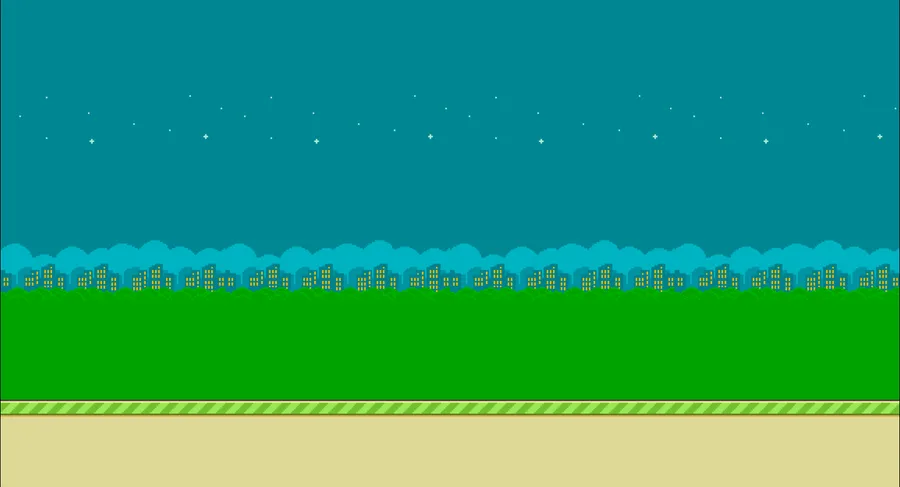

# 🐦 Next.js Flappy Bird

A modern implementation of the classic Flappy Bird game built with Next.js, TypeScript, and Tailwind CSS. The game is fully responsive and works on both desktop and mobile devices.



## 🎮 Play Now

[Play the game here](https://flappybird-mltpascual.vercel.app/)

## ✨ Features

- 🎯 Responsive design that works on all devices
- 📱 Touch and keyboard controls
- 🎨 Smooth animations and physics
- 🏆 Level progression system
- 💫 Dynamic difficulty scaling
- 🖼️ Custom sprites and backgrounds
- 🎵 Background music with mute option
- 📊 Real-time score tracking
- 🌟 Modern UI with Tailwind CSS
- 🎨 Smooth bird rotation physics
- 🌈 Responsive canvas scaling
- 🔄 Auto-adjusting game speed

## 🎵 Audio Features

- Background music that plays during gameplay
- Music automatically stops on game over
- Restarts when game is resumed
- Automatic looping when track ends
- Mute/Unmute toggle button
- Audio state persistence

## 🚀 Getting Started

### Prerequisites

- Node.js 16.x or later
- npm or yarn

### Installation

1. Clone the repository:
```bash
git clone https://github.com/mltpascual/flappybird.git
cd flappybird
```

2. Install dependencies:
```bash
npm install
# or
yarn install
```

3. Run the development server:
```bash
npm run dev
# or
yarn dev
```

4. Open [http://localhost:3000](http://localhost:3000) in your browser

## 🎯 How to Play

- **Desktop**: Press the SPACE bar to make the bird jump
- **Mobile**: Tap the screen to make the bird jump
- Avoid hitting the pipes and the ground/ceiling
- Score points by passing through the gaps between pipes
- Level up every 5 points
- Game speed increases with each level
- Toggle music with the mute button in top-right corner

## 🛠️ Built With

- [Next.js](https://nextjs.org/) - React framework
- [TypeScript](https://www.typescriptlang.org/) - Type safety
- [Tailwind CSS](https://tailwindcss.com/) - Styling
- HTML5 Canvas - Game rendering
- Web Audio API - Background music
- React Hooks - State management

## 📱 Responsive Design

The game automatically adjusts to different screen sizes:
- Maintains aspect ratio
- Scales game elements proportionally
- Optimized touch targets for mobile
- Responsive UI elements
- Adjusts canvas resolution
- Scales difficulty based on screen size

## 🎨 Game Features

- Smooth bird animation with rotation
- Randomly generated pipes with balanced gaps
- Precise collision detection
- Score tracking and persistence
- Progressive level system
- Polished game over screen
- Loading screen with asset progress
- Background parallax effect
- Audio integration
- Mobile-friendly controls

## 🔧 Configuration

Game constants can be adjusted in the `getScaledConstants` function:
- Gravity
- Jump strength
- Game speed
- Pipe width
- Gap height
- Bird size
- Hitbox size
- Audio settings

## 🚀 Deployment

The game is deployed on Vercel. To deploy your own version:

1. Fork this repository
2. Create a new project on [Vercel](https://vercel.com)
3. Connect your forked repository
4. Deploy!

## 📝 License

This project is open source and available under the [MIT License](LICENSE).

## 🤝 Contributing

Contributions, issues, and feature requests are welcome! Feel free to check the [issues page](https://github.com/mltpascual/flappybird/issues).

## 👨‍💻 Author

- Miguel Pascual
- GitHub: [@mltpascual](https://github.com/mltpascual)

## 🙏 Acknowledgments

- Original Flappy Bird game by Dong Nguyen
- Next.js team for the amazing framework
- The open-source community
- Background music credits (add music credits here)

---

Made with ❤️ and Next.js
